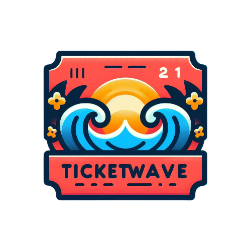

<div>
  <h1 align="center"> TICKETWAVE - Progetto D24 
   </h1> 
</div>
  
<p float="left">
  
  &nbsp;
  
  &nbsp;  
  
  &nbsp;
  
</p>

TicketWave è un software che permette di acquistare e vendere biglietti riguardanti eventi di diverso tipo. Gli utenti che interagiscono su TicketWave possono essere di 2 tipi: Clienti e Gestori. I primi possono ricercare ed acquistare dei biglietti riguardanti uno o più eventi, mentre i secondi possono creare e gestire gli eventi. 

## Features
TicketWave permette di svolgere diverse attività: 
- Creazione di 2 diversi tipi di account: Gestore e Cliente
- Area riservata per l'account Gestore e Cliente
- Possibilità di comprare un abbonamento da parte del Gestore, questo è utile al fine di creare eventi
- Sistema di statistiche riguardo gli eventi creati dal Gestore
- Possibilità di creare nuovi eventi da parte del Gestore
- Possibilità di ricercare eventi
- Sistema di notifiche riguardo gli eventi sia per il Gestore che per il Cliente

## Dipendenze 
Il software per funzionare necessita l'installazione delle seguenti librerie:
- [JavaFX 21](https://gluonhq.com/products/javafx/)
- [JUnit 4](https://github.com/junit-team/junit4/releases/tag/r4.13.2)
- [MySQL java connector](https://github.com/mysql/mysql-connector-j)

## Setup iniziale  
Per quanto riguarda il database MySQL:
1. Aprire MySQL Workbench e creare un'istanza in locale del database
2. Importare i file TicketWaveDB e TicketWavePopolamento
3. Creare un profilo di accesso al database chiamato User e concedergli le corrette autorizzazioni

Per quanto riguarda IntelliJ:
1. Aprire IntelliJ, selezionare Get from VCS, copiare da GitHub l'URL andando su Code ed infine incollare l'URL su IntelliJ
2. Importare tutte le librerie utili (JAVAFX 21, JUnit 4 e MySQL Java connector) tramite ProjectStructure -> Libraries -> Add
3. Successivamente andare su Modules e spuntare tutte le librerie implementate
4. Prima di eseguire la classe Main mettere le VM options tramite Run/Debug Configurations -> Edit Configurations -> Main -> Modify options -> Add VM options e immettere la stringa ```--module-path /path/to/javafx-sdk-22.0.1/lib --add-modules javafx.controls,javafx.fxml ```

## Documentazione
Prima di eseguire il software si consiglia di controllare la documentazione presente su GitHub

## Immagini

